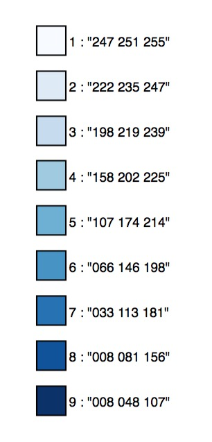
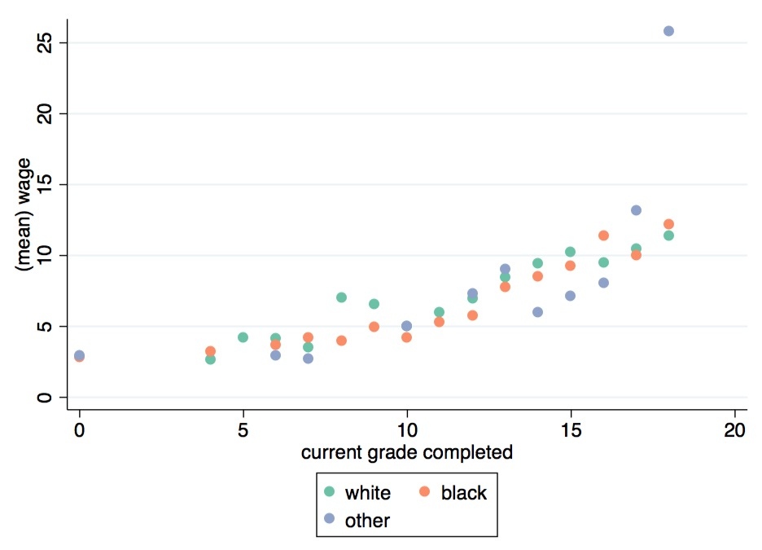

The command `colorscheme` returns a set of RGB colors corresponding to precified themes.

The syntax requires to specify the number of colors and the palette name: 

```
. colorscheme 4, palette(Blues)
. return list
macros
			r(color1) : "239 243 255"
            r(color2) : "189 215 231"
            r(color3) : "107 174 214"
            r(color4) : "033 113 181"
            r(colors) : `""239 243 255" "189 215 231" "107 174 214" "033 113 181""'
```

### Colorbrewer palettes

There are 3 types of palettes, sequential, diverging, and qualitative.


#### Sequential Palettes
Sequential palettes are suited to ordered data that progress from low to high. Lightness steps
dominate the look of these schemes, with light colors for low data values to dark colors for high
data values. All the sequential palettes are available in variations from 3 different values up to 9 different values.

The sequential palettes names are: Blues BuGn BuPu GnBu Greens Greys Oranges OrRd PuBu PuBuGn PuRd Purples RdPu Reds YlGn YlGnBu YlOrBr YlOrRd

#### Diverging Palettes
Diverging palettes put equal emphasis on mid-range critical values and extremes at both ends
of the data range. The critical class or break in the middle of the legend is emphasized with light
colors and low and high extremes are emphasized with dark colors that have contrasting hues. All the diverging palettes are available in variations from 3 different values up to 11 different values.


The diverging palettes are:	BrBG PiYG PRGn PuOr RdBu RdGy RdYlBu RdYlGn Spectral


#### Qualitative Palettes
Qualitative palettes do not imply magnitude differences between legend classes, and hues are
used to create the primary visual differences between classes. Qualitative schemes are best suited
to representing nominal or categorical data. 

The qualitative palettes (with their associated maximum number of colors) are: Accent (8) Dark2 (8) Paired (12) Pastel1 (9) Pastel2 (8) Set1 (9) Set2 (8) Set3 (12)

### Other palettes
The command includes two supplementary palettes:

- [paultol](http://www.sron.nl/~pault/colourschemes.pdf): qualitative palette up to 12 colors

- [default ggplot palette](http://docs.ggplot2.org/0.9.3.1/scale_hue.html) : colour scale with evenly spaced hues. 

### Usage 


- Use the option `display` to plot the palette

```
colorscheme 9, palette(Blues) display
```




- use the returned macro `r(color1)`, `r(color2)`, ... in a plot

```
sysuse nlsw88.dta, clear
collapse (mean) wage, by(grade race)
colorscheme 3, palette(Set2)
twoway ///
(scatter wage grade if race == 1, mcolor("`=r(color1)'") legend(label(1 `"`: label (race) 1'"'))) msize(1.5) ///
(scatter wage grade if race == 2, mcolor("`=r(color2)'") legend(label(2 `"`: label (race) 2'"'))) msize(1.5) ///
(scatter wage grade if race == 3, mcolor("`=r(color3)'") legend(label(3 `"`: label (race) 3'"'))) msize(1.5) ///
, plotregion(fcolor(white)) graphregion(fcolor(white))
```


## Installation

```
net install colorscheme, from("https://raw.githubusercontent.com/matthieugomez/colorscheme.ado/master/")
```

If you have a version of Stata < 13, you need to install it manually

1. Click the "Download ZIP" button in the right column to download a zipfile. 
2. Extract it into a folder (e.g. ~/SOMEFOLDER)
3. Run

	```
	cap ado uninstall colorscheme
	net install colorscheme, from("~/SOMEFOLDER")
	```

## Copyright
This product includes color specifications and designs developed by Cynthia Brewer : http://colorbrewer.org/
ColorBrewer is Copyright (c) 2002 Cynthia Brewer, Mark Harrower, and The Pennsylvania State
University. All rights reserved.

