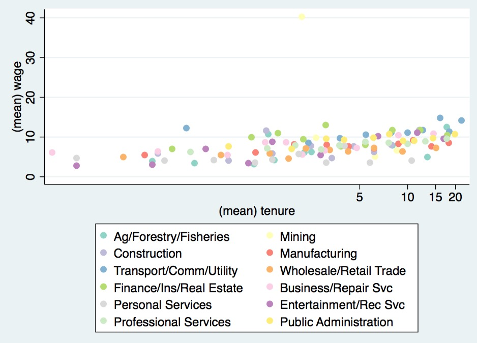
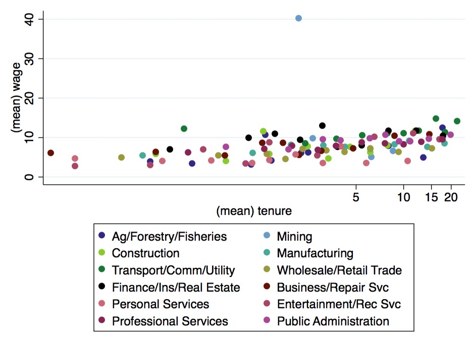
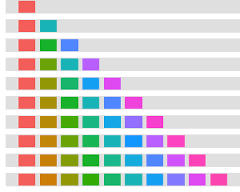

The command `colorscheme` return set of RGB colors for plotting graphs

The syntax is

```
. colorscheme 4, palette(Blues)
. return list
macros
			r(color1) : "239 243 255"
            r(color2) : "189 215 231"
            r(color3) : "107 174 214"
            r(color4) : "033 113 181"
            r(colors) : ""239 243 255" "189 215 231" "107 174 214" "033 113 181""
```

### Palettes

There are 3 types of palettes, sequential, diverging, and qualitative.


#### Sequential Palettes
Sequential palettes are suited to ordered data that progress from low to high. Lightness steps
dominate the look of these schemes, with light colors for low data values to dark colors for high
data values. All the sequential palettes are available in variations from 3 different values up to 9 different values.

	The sequential palettes names are: Blues BuGn BuPu GnBu Greens Greys Oranges OrRd PuBu PuBuGn PuRd Purples RdPu Reds YlGn YlGnBu YlOrBr YlOrRd

#### Diverging Palettes
Diverging palettes put equal emphasis on mid-range critical values and extremes at both ends
of the data range. The critical class or break in the middle of the legend is emphasized with light
colors and low and high extremes are emphasized with dark colors that have contrasting hues. All the diverging palettes are available in variations from 3 different values up to 11 different values.


	The diverging palettes are:	BrBG PiYG PRGn PuOr RdBu RdGy RdYlBu RdYlGn Spectral


#### Qualitative Palettes
Qualitative palettes do not imply magnitude differences between legend classes, and hues are
used to create the primary visual differences between classes. Qualitative schemes are best suited
to representing nominal or categorical data. 

The qualitative palettes (with their associated maximum number of colors) are: Accent (8) Dark2 (8) Paired (12) Pastel1 (9) Pastel2 (8) Set1 (9) Set2 (8) Set3 (12)


The package also includes two supplementary palettes:
- [default ggplot palette](http://docs.ggplot2.org/0.9.3.1/scale_hue.html) : colour scale with evenly spaced hues (no limit on color number)

- [paultol](http://www.sron.nl/~pault/colourschemes.pdf): qualitative palette with 12 colors


### Usage 

I first define a function that takes a palette name as an argument and return a scatterplot by industry
```
program define byindustry
sysuse nlsw88.dta, clear
syntax anything(name = palette)
local script ""
local label ""
egen xtile = xtile(tenure), by(industry) n(10)
collapse (mean) wage tenure, by(xtile industry)
colorscheme 12, palette(`palette')
forvalues i = 1/12{
local script `script' (scatter wage tenure if industry == `i', mcolor("`=r(color`i')'")   msize(1.5)  xscale(log) legend(label(`i' `"`: label (industry) `i''"')))
}
di `"`script'"'
twoway `script'
end
```


```
byindustry Paired
```


```
byindustry Set3
```



```
byindustry paultol
```




```
byindustry ggplot
```



## Installation

```
net install colorscheme , from(https://github.com/matthieugomez/stata-color/raw/master/)
```


## Copyright
This product includes color specifications and designs developed by Cynthia Brewer : http://colorbrewer.org/
ColorBrewer is Copyright (c) 2002 Cynthia Brewer, Mark Harrower, and The Pennsylvania State
University. All rights reserved.

